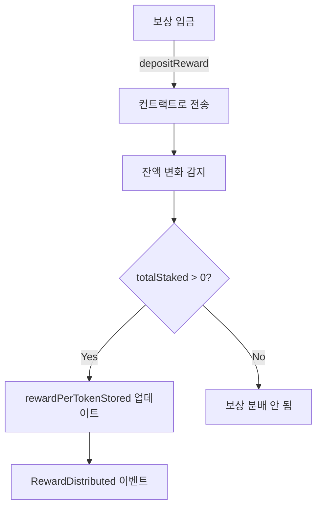
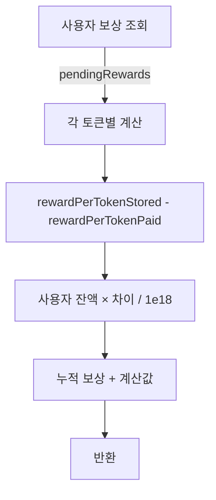
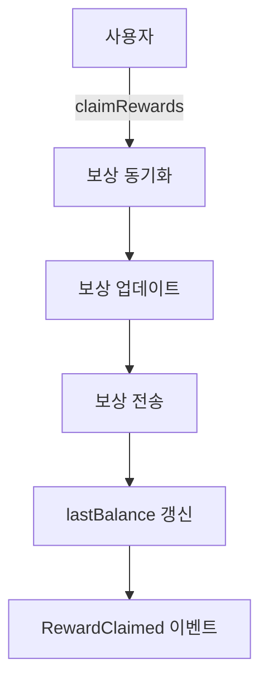

# CrossStakingPool 아키텍처 설계

## 📐 개요

CrossStakingPool은 **rewardPerToken 누적 방식**을 사용하는 CROSS 토큰 스테이킹 풀입니다.

### 핵심 특징

- ✅ 다중 보상 토큰 지원
- ✅ 실시간 보상 입금 방식
- ✅ UUPS 업그레이더블 패턴
- ✅ 역할 기반 접근 제어
- ✅ Pausable 긴급 정지
- ✅ 가스 최적화 (O(1) lookup)

---

## 🏗️ 컨트랙트 구조

### 상속 체계

```
Initializable
    ↓
AccessControlDefaultAdminRulesUpgradeable
    ↓
PausableUpgradeable
    ↓
ReentrancyGuardTransientUpgradeable
    ↓
UUPSUpgradeable
    ↓
CrossStakingPool
```

### 주요 컴포넌트

#### 1. 상태 변수

**스테이킹 관련:**
```solidity
IERC20 public stakingToken;              // CROSS 토큰
mapping(address => uint) public balances; // 사용자별 예치 금액
uint public totalStaked;                  // 전체 예치량
```

**보상 관련:**
```solidity
RewardToken[] public rewardTokens;        // 보상 토큰 배열
mapping(address => uint) public tokenToIndex;          // O(1) lookup
mapping(address => bool) public isRewardToken;         // 등록 여부
mapping(address => mapping(uint => UserReward)) public userRewards; // 사용자 보상
```

#### 2. 데이터 구조

**RewardToken:**
```solidity
struct RewardToken {
    address tokenAddress;           // 보상 토큰 주소
    uint rewardPerTokenStored;      // 누적 "토큰당 보상"
    uint lastBalance;               // 마지막 기록 잔액 (보상 감지용)
}
```

**UserReward:**
```solidity
struct UserReward {
    uint rewardPerTokenPaid;  // 사용자의 체크포인트 (마지막 정산 시점)
    uint rewards;             // 누적 보상 (아직 claim 안한)
}
```

#### 3. 역할(Roles)

| 역할 | 권한 | 용도 |
|------|------|------|
| `DEFAULT_ADMIN_ROLE` | 업그레이드, 역할 관리 | 최고 관리자 |
| `PAUSER_ROLE` | pause/unpause | 긴급 정지 |
| `REWARD_MANAGER_ROLE` | 보상 토큰 추가 | 보상 관리 |

---

## 🔄 핵심 플로우

### 스테이킹 플로우

```mermaid
graph TD
    A[사용자] -->|stake(amount)| B[보상 동기화]
    B --> C[기존 보상 업데이트]
    C --> D[CROSS 전송]
    D --> E[잔액 증가]
    E --> F[체크포인트 갱신]
    F --> G[Staked 이벤트]
```

**코드:**
```solidity
stake(amount)
  ↓
1. _syncReward()           // 새 보상 입금 감지
  ↓
2. _updateRewards(user)    // 기존 예치분 보상 계산
  ↓
3. transferFrom(CROSS)     // CROSS 수령
  ↓
4. balances[user] += amount
   totalStaked += amount
  ↓
5. emit Staked
```

### 보상 분배 플로우



**공식:**
```
새 보상이 입금되면:
rewardPerTokenStored += (새보상 × 1e18) / totalStaked
```

### 보상 계산 플로우



**공식:**
```
사용자 보상 = 
  누적보상(ur.rewards) + 
  사용자잔액 × (rewardPerTokenStored - rewardPerTokenPaid) / 1e18
```

### 클레임 플로우



**주의:**
- ✅ 보상 전송 후 `lastBalance` 갱신 필수
- ✅ 전송된 보상이 새 보상으로 인식되지 않도록

---

## 🔐 보안 메커니즘

### 1. 재진입 공격 방어

```solidity
ReentrancyGuardTransientUpgradeable
```

- ✅ 모든 외부 호출 함수에 `nonReentrant` modifier
- ✅ Transient storage 사용으로 가스 절약

### 2. 접근 제어

```solidity
AccessControlDefaultAdminRulesUpgradeable
```

- ✅ 2단계 관리자 전환 프로세스
- ✅ `initialDelay`로 시간 지연 보호
- ✅ 세분화된 역할 관리

### 3. 긴급 정지

```solidity
PausableUpgradeable + whenNotPaused
```

- ✅ 긴급 상황 시 stake/unstake/claim 차단
- ✅ PAUSER_ROLE만 실행 가능

### 4. 업그레이드 보호

```solidity
UUPSUpgradeable + _authorizeUpgrade
```

- ✅ DEFAULT_ADMIN_ROLE만 업그레이드 가능
- ✅ Proxy 패턴으로 상태 보존

### 5. 입력 검증

```solidity
require(amount >= MIN_STAKE_AMOUNT)           // 최소 금액
require(tokenAddress != address(stakingToken)) // CROSS를 보상으로 사용 방지
require(!isRewardToken[tokenAddress])          // 중복 등록 방지
```

---

## 💾 Storage 레이아웃

### Storage Gap

```solidity
uint[43] private __gap;
```

**목적:** 향후 업그레이드 시 새로운 변수 추가 가능

**계산:**
- OpenZeppelin 권장: 50 slots
- 현재 사용: 7 slots (RewardToken[], mappings, etc.)
- Gap: 43 slots

---

## 🎯 설계 원칙

### 1. rewardPerToken 누적 방식

**누적 보상 방식:**
- 개별 사용자마다 보상을 계산하지 않음
- 전역 `rewardPerTokenStored` 사용
- 사용자는 체크포인트(`rewardPerTokenPaid`)로 자신의 보상만 계산

**장점:**
- ✅ O(1) 가스 비용 (사용자 수와 무관)
- ✅ 확장성 우수
- ✅ 수학적으로 정확

### 2. Pull over Push

**보상 수령 방식:**
- ❌ Push: 보상을 자동으로 전송
- ✅ Pull: 사용자가 직접 claim

**장점:**
- ✅ 재진입 공격 방어
- ✅ 가스비 예측 가능
- ✅ 사용자가 타이밍 선택

### 3. Checks-Effects-Interactions

**모든 함수에서 준수:**
```solidity
// 1. Checks
require(balances[msg.sender] > 0, NoStakeFound());

// 2. Effects
balances[msg.sender] = 0;
totalStaked -= amount;

// 3. Interactions
stakingToken.safeTransfer(msg.sender, amount);
```

### 4. 이벤트 기반 투명성

**모든 주요 액션에 이벤트:**
- `Staked`, `Unstaked`
- `RewardDeposited`, `RewardDistributed`
- `RewardClaimed`

**Off-chain 추적:**
- 블록체인 상태 변화 추적
- 보상 정확성 검증
- 감사(Audit) 용이

---

## 📊 가스 최적화

### 1. O(1) Lookup

```solidity
mapping(address => uint) public tokenToIndex;  // 배열 인덱스 캐싱
```

**효과:**
- Before: O(n) 순회 (~10,000 gas)
- After: O(1) 조회 (~2,100 gas)
- **절약: ~79%**

### 2. Transient Storage

```solidity
ReentrancyGuardTransientUpgradeable
```

**효과:**
- Before: SSTORE/SLOAD (~20,000 gas)
- After: Transient storage (~100 gas)
- **절약: ~99%**

### 3. SafeERC20 최소 사용

- ✅ `safeTransferFrom`, `safeTransfer`만 사용
- ✅ `approve` 로직 없음 (사용자가 직접)

---

## 🔧 확장성

### UUPS 업그레이드 가능

**추가 가능한 기능:**
- NFT 보상
- Lock 기간 설정
- Boost 메커니즘
- Referral 시스템

**제약:**
- Storage 레이아웃 유지 필요
- `__gap` 활용하여 새 변수 추가
- 기존 로직 수정 시 주의

### 다중 보상 토큰

**현재 제한 없음:**
- 이론적으로 무제한 보상 토큰
- Loop overhead만 고려

**권장:**
- 실전에서는 3-5개 정도 권장
- 너무 많으면 가스비 증가

---

## 📈 확장 예시

### 시간 Lock 추가 (예시)

```solidity
struct StakeInfo {
    uint amount;
    uint lockUntil;  // 새 변수 (__gap 사용)
}

mapping(address => StakeInfo) public stakeInfos;

function unstake() external {
    require(block.timestamp >= stakeInfos[msg.sender].lockUntil);
    // ...
}
```

### NFT 보상 추가 (예시)

```solidity
struct NFTReward {
    address nftContract;
    uint[] tokenIds;
}

// __gap 활용하여 새 mapping 추가
mapping(address => NFTReward) public nftRewards;
```

---

## 🎓 설계 패턴

### 사용된 패턴

1. **Factory Pattern** - 다중 보상 토큰 생성
2. **Singleton Pattern** - UUPS proxy
3. **Observer Pattern** - 이벤트 기반
4. **Strategy Pattern** - 교체 가능한 구현

### DeFi 모범 사례

- ✅ Pull over Push
- ✅ Checks-Effects-Interactions
- ✅ 이벤트 발생
- ✅ View 함수 제공
- ✅ 명확한 에러 메시지

---

## 📚 참고 구현

### 참고 구현

**유사 패턴:**
- Synthetix StakingRewards: https://github.com/Synthetixio/synthetix

**주요 개선점:**
- ✅ 다중 보상 토큰 (기존: 단일)
- ✅ 실시간 입금 방식 (기존: 기간 기반)
- ✅ UUPS 업그레이더블 (기존: 고정)
- ✅ 역할 기반 제어 (기존: Ownable)

### OpenZeppelin 컨트랙트

**사용된 컴포넌트:**
- `AccessControlDefaultAdminRulesUpgradeable`
- `PausableUpgradeable`
- `ReentrancyGuardTransientUpgradeable`
- `UUPSUpgradeable`
- `SafeERC20`

**버전:** v5.4.0

---

## 🔍 디자인 결정 사항

### 1. 왜 실시간 입금 방식인가?

**기존 방식 (기간 기반):**
```solidity
// 7일간 1000 토큰 분배
rewardRate = 1000 / 7 days
```

**단점:**
- 보상 기간 설정 필요
- 기간 종료 후 재설정 필요
- 유연성 부족

**우리 방식 (실시간):**
```solidity
// 언제든지 입금 가능
depositReward(token, amount)
→ 즉시 현재 스테이커들에게 분배
```

**장점:**
- ✅ 유연한 보상 스케줄
- ✅ 프로토콜 수익을 즉시 분배 가능
- ✅ 기간 관리 불필요

### 2. 왜 다중 보상 토큰인가?

**단일 vs 다중:**
- 단일: 간단, 가스 저렴
- 다중: 유연, 다양한 인센티브

**우리 선택:**
- ✅ 다중 보상 토큰
- ✅ DeFi 생태계 통합 용이
- ✅ 예: USDT + DAO토큰 동시 지급

### 3. 왜 UUPS인가?

**Proxy 패턴 비교:**

| 패턴 | 업그레이드 로직 위치 | 가스 | 보안 |
|------|---------------------|------|------|
| Transparent | Proxy | 높음 | 중간 |
| **UUPS** | **Implementation** | **낮음** | **높음** |
| Beacon | Beacon | 중간 | 중간 |

**UUPS 선택 이유:**
- ✅ 가스비 저렴 (delegatecall overhead 없음)
- ✅ Implementation에 업그레이드 로직 (더 안전)
- ✅ OpenZeppelin 권장 방식

---

## 🎯 사용 시나리오

### 시나리오 1: 단순 스테이킹

```solidity
1. Alice: stake(100 CROSS)
2. Protocol: depositReward(1000 USDT)
3. Alice: unstake()
   → 100 CROSS + 1000 USDT 받음
```

### 시나리오 2: 다중 사용자

```solidity
1. Alice: stake(100 CROSS)
2. Bob: stake(200 CROSS)
3. Protocol: depositReward(300 USDT)
   → Alice pending: 100 USDT (1/3)
   → Bob pending: 200 USDT (2/3)
```

### 시나리오 3: 중도 클레임

```solidity
1. Alice: stake(100 CROSS)
2. Protocol: depositReward(500 USDT)
3. Alice: claimRewards()
   → 500 USDT 받음, 100 CROSS는 유지
4. Protocol: depositReward(500 USDT)
5. Alice: claimRewards()
   → 추가로 500 USDT 받음
```

### 시나리오 4: 시간차 스테이킹

```solidity
1. Alice: stake(100 CROSS)
2. Protocol: depositReward(1000 USDT)
   → Alice만 있으므로 전체 받음
3. Bob: stake(100 CROSS)
   → 이전 보상 못 받음 (공정성)
4. Protocol: depositReward(1000 USDT)
   → Alice: 500, Bob: 500 (동일 지분)
```

---

## 📏 제약사항

### 기술적 제약

1. **최소 스테이킹:** 1 CROSS
2. **보상 토큰:** CROSS는 사용 불가
3. **정밀도:** 1e18 (wei 단위)

### 운영 제약

1. **업그레이드:** DEFAULT_ADMIN_ROLE 필요
2. **일시정지:** PAUSER_ROLE 필요
3. **보상 토큰 추가:** REWARD_MANAGER_ROLE 필요

### 경제적 제약

1. **보상 입금:** 누구나 가능 (의도적 설계)
2. **스테이커 0명:** 보상 분배 안 됨 (손실)
3. **정밀도 손실:** 매우 작은 보상 시 가능

---

## 🚀 배포 가이드

### 1. 배포 순서

```bash
# 1. Implementation 배포
implementation = new CrossStakingPool()

# 2. Proxy 배포 및 초기화
initData = abi.encodeWithSelector(
    CrossStakingPool.initialize.selector,
    CROSS_TOKEN,
    ADMIN_ADDRESS,
    2 days
)
proxy = new ERC1967Proxy(implementation, initData)

# 3. 보상 토큰 등록
pool.addRewardToken(REWARD_TOKEN_1)
pool.addRewardToken(REWARD_TOKEN_2)
```

### 2. 초기 설정

**권장값:**
- `initialDelay`: 2-7 days
- `MIN_STAKE_AMOUNT`: 1 ether (조정 가능)

### 3. 업그레이드 절차

```bash
# 1. 새 Implementation 배포
newImpl = new CrossStakingPoolV2()

# 2. 관리자가 업그레이드
pool.upgradeToAndCall(newImpl, "")

# 3. 검증
assert pool.version() == 2
```

---

## 🎨 아키텍처 다이어그램

### 전체 구조

```
┌─────────────────────────────────────────┐
│         CrossStakingPool (Proxy)        │
├─────────────────────────────────────────┤
│                                         │
│  ┌────────────┐      ┌──────────────┐  │
│  │   Users    │      │   Rewards    │  │
│  │            │      │              │  │
│  │ - stake()  │      │ - USDT       │  │
│  │ - unstake()│◄─────┤ - DAI        │  │
│  │ - claim()  │      │ - Other ERC20│  │
│  └────────────┘      └──────────────┘  │
│         │                    │         │
│         ▼                    ▼         │
│  ┌────────────────────────────────┐   │
│  │   Reward Calculation Engine    │   │
│  │   (rewardPerToken 누적)        │   │
│  │                                │   │
│  │ rewardPerTokenStored           │   │
│  │ userRewardPerTokenPaid         │   │
│  └────────────────────────────────┘   │
│                                         │
├─────────────────────────────────────────┤
│         Security & Governance           │
│                                         │
│  ┌─────────┐ ┌──────────┐ ┌─────────┐ │
│  │AccessCtl│ │ Pausable │ │ Reentry │ │
│  └─────────┘ └──────────┘ └─────────┘ │
└─────────────────────────────────────────┘
         │
         ▼
    Implementation
      (Upgradeable)
```

---

## 📖 요약

**CrossStakingPool**은:
1. rewardPerToken 누적 방식 스테이킹 풀
2. 다중 보상 토큰 지원
3. UUPS 업그레이더블
4. 역할 기반 보안
5. 가스 최적화
6. Production-ready

**적합한 용도:**
- DeFi 프로토콜 수익 분배
- DAO 토큰 인센티브
- Liquidity Mining
- Staking-as-a-Service

